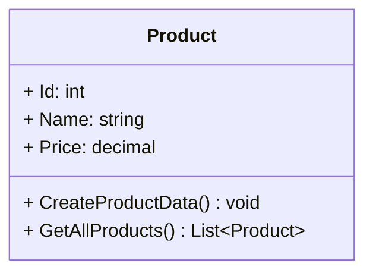
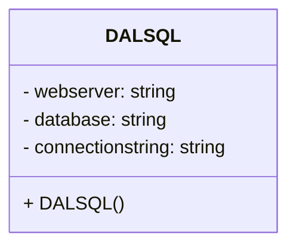
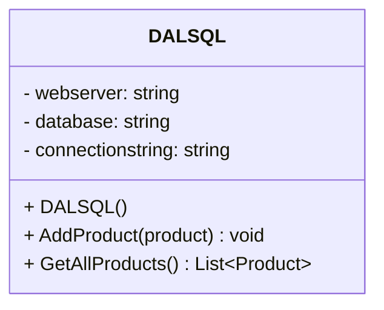

# Handleiding project opzetten

------

[TOC]

------

## Intro: Wat ga je leren?

- Hoe je data opslaat en ophaalt uit SQL Server.
- Hoe een **modelklasse** werkt.
- Hoe een **DAL** (Data Access Layer) werkt.
- Hoe je **INSERT** en **SELECT** uitvoert met `SqlCommand`.
- Hoe je console UTF‑8 instelt voor juiste tekens (zoals €).

---

## Technische details

```c#
📦 ProjectSetupDemo/
├── 📁 Code/
│   ├── 📄 Bestelsysteem.sln     		# Visual Studio Solution
│   ├── 📁 Bestelsysteem/        		# Folder voor de applicatie
│   │   ├── 📄 Program.cs			    # Service (hier komt de logica)
│   │   ├── 📁 Models/        			# Domain Models
|   |   |   └──📄 Product.cs    		# Het model product
│   │   ├── 📁 DataAccess/     			# Data Access Layer
|   |   |   └──📄 DALSQL.cs	 		    # Afhandeling SQL
│   │   └── 📁 Exceptions/     			# Custom Exceptions
├── 📁 DatabaseScripts/      			# SQL Database Scripts
|   └──📄Product_Create.sql				# SQl create script
├── 📁 Design/           				# UML Design Files
├── .gitignore    						# Verborgen bestand, belangrijk voor repository!!
└── 📄 readme.md          				# Dit bestand
```

## Technologiestack

- **Framework**: .NET Core 9.0
- **UI**: Console applicatie
- **Database**: Microsoft SQL Server
- **Modellering**: UMLet, DrawIO, Mermaid, PlantUML

## Ontwikkelomgeving

- **IDE**: Visual Studio 2019/2022 (Visual Studio Code)
- **Vereisten**: .NET Core SDK, SQL Server
- **Nuget package**: Microsoft.Data.SqlClient

------

## Stap 1: Het Model

Zoek de 📁 Code/📁 Bestelsysteem/📁 Models folder in het project. Maak hierin een class aan 📄`Product.cs` op basis van het klassendiagram.



> [!TIP]
>
> Een model beschrijft de structuur van je gegevens.
>

---

## Stap 2: Script(s) toevoegen

Zoek de folder  📁 Scripts in het project. Maak een nieuw bestand 📄`create_product.sql`:

```sql
CREATE TABLE Product (
    Id INT IDENTITY(1,1) PRIMARY KEY,
    Naam NVARCHAR(100) NOT NULL,
    Prijs DECIMAL(10,2) NOT NULL
);
```

### Stap 2.1: Database inclusief tabel aanmaken

Maak een nieuwe database met de naam: 🗄️`Bestelsysteem`

Open het bestand 📁 Scripts/📄`create_product.sql` in SQL Server Management Studio selecteer de juiste database 🗄️`Bestelsysteem` en run de query.

Test de onderstaande `SELECT` query:

```sql
SELECT * FROM Product;
```

> [!NOTE]
>
> Waarom krijg je geen resultaten?

------

## Stap 3: Repository Structuur

Verantwoordelijkheden van een **repository**:

- Beheert opslag
- Opent verbinding
- Voert SQL‑commands uit
- Geeft objecten terug

### Stap 3.1: Installeren van NuGet Package

- Gebruik `Microsoft.Data.SqlClient`.
- Voeg via NuGet Package Manager `Microsoft.Data.SqlClient` toe aan je project om zo gebruik te maken van de `SqlConnection` en de `SqlCommand`

### Stap 3.2: Maak ProductRepository als class aan

Zoek de folder 📁 Code/📁 Bestelsysteem/📁 DataAccess in het project. Maak een nieuw bestand 📄`DALSQL.cs`.

Implementeer onderstaand klassendiagram. Maak het field en de constructor aan.



### Stap 3.3: Maak de basis van de DALSQL

Een van de belangrijkste onderdelen is het goed zetten van de connectionstring. Hiermee geef je aan hoe de applicatie de connectie maakt met de database. Deze is er in veel verschillende varianten onderstaand is de variant die wij hanteren tijdens Create.

```c#
.... 
	public class DALSQL
 	{
        private string webserver;
        private string database;
        private readonly string connectionstring;
        
        public DALSQL()
        {
 			webserver = ".";
			database = "Bestelsysteem";
 			connectionstring = $"Server={webserver};Database={database};Trusted_Connection=True;TrustServerCertificate=True;"
        }
 	}
....
```

> [!TIP]
>
> De connectionstring bestaat voor nu uit de volgende elementen
>
> | Onderwerp                | Beschrijving                                                 | Voorbeeld                    |
> | ------------------------ | ------------------------------------------------------------ | ---------------------------- |
> | `Server`                 | Dit is de locatie van je SQL-server database. Meestal is deze localhost of SQLSERVER de `.` pakt de default server en is voor het ontwikkelen het meest eenvoudig. | Server=.;                    |
> | `Database`               | Dit is de naam van de database waar de connectie naar gemaakt wordt. | Database=Bestelsysteem;      |
> | `Trusted_Connection`     | Dit betekent **dat Windows-authenticatie wordt gebruikt**, niet “vertrouwd” in algemene zin. Het is dus expliciet géén SQL-gebruiker met username/password. | Trusted_Connection=True;     |
> | `TrustServerCertificate` | Het gaat specifiek om het **accepteren van een (mogelijk ongeldig of zelfondertekend) SSL-certificaat** bij versleutelde verbindingen. (Dit **nooit** zomaar in **productie** zetten!!) | TrustServerCertificate=True; |

------

## Stap 4: INSERT uitvoeren

Toevoegen van een product implementeren.



### Stap 4.1: Functionaliteit voor product toevoegen implementeren

Implementeer de methode `AddProduct(product)` zoals in bovenstaand klassendiagram te zien is en voeg deze toe aan het bestand `DALSQL.cs` die staat in de folder: 📁 Code/📁 Bestelsysteem/📁 DataAccess/📄 `DALSQL.cs`.

```csharp
....
    public void AddProduct(Product product)
    {
        string query = "INSERT INTO Product (Name, Price) VALUES (@Name, @Price)";

        using SqlConnection connection = new SqlConnection(_connectionString);
        using SqlCommand command = new SqlCommand(query, connection);

        command.Parameters.AddWithValue("@Name", product.Name);
        command.Parameters.AddWithValue("@Price", product.Price);

        connection.Open();
        command.ExecuteNonQuery();
    }
....
```

> [!NOTE]
>
> Waarom wordt in de query niets gedaan met Id?

> [!IMPORTANT]
>
> Gebruik `ExecuteNonQuery` bij SQL-commando’s die **iets veranderen** in de database, maar **geen data teruggeven**.
> Let op: de methode geeft een **getal** terug.
>
>  Wat zou dat getal betekenen, en hoe kun je dat gebruiken in je code?
>
> ------
>
> ### Tip: werken met `@parameters`
>
> Gebruik altijd `@parameters` bij SQL-commando’s waarin waarden worden meegegeven.
>
> - Wat zou er kunnen gebeuren als je gebruikersinvoer direct in je SQL-string plakt?
> - Waarom zou SQL Server parameters “fijner” vinden dan samengestelde strings?

### Stap 4.2: Implementeer de "methode" in de klasse Product om een product toe te voegen

In het bestand  📁 Code/📁 Bestelsysteem/📁 Models/📄`Product.cs` gaan we de implementatie maken voor de methode `CreateProductData`.  Dit gebeurt in de klasse `Product` we hebben een object nodig van de klasse `DALSQL` om daadwerkelijk een product op te slaan in de database.

```c#
....
	public void CreateProductData()
	{
    	DALSQL dalSql = new DALSQL();
    	dalSql.AddProduct(this);
	}
....
```


### Stap 4.3: Implementeer de "front-end" functionaliteit om een product toe te voegen

We willen nu ook een product daadwerkelijk toevoegen aan de database, implementeer daarvoor de volgende code in het bestand `Program.cs` dat je kunt vinden in de folder 📁 Code/📁 Bestelsysteem/📄 `Program.cs`.

```c#
.... 
     static void Main(string[] args)
     {
        // Maak een nieuw product aan
        Product newProduct = new Product(
            "Koffie",
            2,65m
        );

        newProduct.CreateProductData();
     }
....
```

> [!NOTE]
>
> **Vraag**: *Hoe kan het zo zijn dat we meerdere keren hetzelfde product kunnen toevoegen als we de applicatie vaker opnieuw starten?*
>
> **Extra opdracht**
>
> Kun je er nu ook voor zorgen dat niet altijd hetzelfde product wordt toegevoegd maar dat bijvoorbeeld een gebruiker dit zou kunnen opvoeren via de console?

------

## Stap 5: SELECT uitvoeren

We gebruiken een select om gegevens uit de database op te halen.


### Stap 5.1  Functionaliteit voor alle producten ophalen te implementeren

Implementeer de methode `GetAllProducts()` zoals in bovenstaand klassendiagram te zien is en voeg deze toe aan het bestand `DALSQL.cs` die staat in de folder: 📁 Code/📁 Bestelsysteem/📁 DataAccess/📄 `DALSQL.cs`.

```c#
....
    public List<Product> GetAllProducts()
    {
        string query = "SELECT Id, Name, Price FROM Product";
        List<Product> products = new List<Product>();

        using (SqlConnection connection = new SqlConnection(connectionString))
        using (SqlCommand command = new SqlCommand(query, connectionString))
        {
            connection.Open();
            using (SqlDataReader reader = command.ExecuteReader())
            {
                while (reader.Read())
                {
                    int id = reader.GetInt32(0);
                    string productName = reader.GetString(1);
                    decimal productPrice = reader.GetDecimal(2);

                    var product = new Product(id, productName, productPrice);

                    products.Add(product);
                }
            }
        }

        return products;
    }
....
```


### Stap 5.3: Implementeer de "methode" in de klasse Product om alle producten op te halen uit de database

In het bestand 📁 Code/📁 Bestelsysteem/📁 Models/📄`Product.cs` gaan we de implementatie maken voor de methode `GetAllProducts`. Dit gebeurt in de klasse `Product` we hebben een object nodig van de klasse `DALSQL` om daadwerkelijk alle producten op te halen uit de database.

```c#
....
	public List<Product> GetAllProducts()
	{
    	//Maak hier de bijbehorende logica om via de DALSQL alle producten op te halen.
	}
....
```


### Stap 5.4: Implementeer de "front-end" functionaliteit om alle producten te tonen die opgehaald zijn

We willen nu ook alle producten tonen die toevoegt zijn aan de database, implementeer daarvoor de volgende code in het bestand `Program.cs` dat je kunt vinden in de folder 📁 Code/📁 Bestelsysteem/📄 `Program.cs`.

```c#
.... 
     static void Main(string[] args)
     {
    	Console.OutputEncoding = Encoding.UTF8; // Dit is nodig voor het tonen van de prijs tekens zoals €;
    	
        // Get all products
        Product emptyProduct = new Product();

        List<Product> producten = emptyProduct.GetAllProducts();

        foreach (Product product in producten)
        {
            Console.WriteLine($"{product.Id}: {product.Name} - {product.Price.ToString("C", CultureInfo.CurrentCulture)}");
        }
	}
....
```


------

## Stap 6: Programma als geheel testen

Deze variant kopiëren als het zelf niet gelukt is in het bestand 📁 Code/📁 Bestelsysteem/📄 `Program.cs`, gebruik anders je eigen tot nu toe opgebouwde variant. 

```c#
.... 
     static void Main(string[] args)
     {
    	Console.OutputEncoding = Encoding.UTF8; // Dit is nodig voor het tonen van de prijs tekens zoals €;
       
    	// Persist the new product
        Product newProduct = new Product(
            "Koffie",
            2,65m
        );

        newProduct.CreateProductData();
    
    	// Get all products
        Product emptyProduct = new Product();

        List<Product> producten = emptyProduct.GetAllProducts();

        foreach (Product product in producten)
        {
            Console.WriteLine($"{product.Id}: {product.Name} - {product.Price.ToString("C", CultureInfo.CurrentCulture)}");
        }
	}
....
```

> [!NOTE]
>
> Lukt het je om een nieuwe implementatie te maken waarbij je, op basis van (een deel van) de productnaam die de gebruiker via de console invoert, **gericht één product ophaalt uit de database**, zonder eerst alle producten in te lezen?
>
> - Wat gebeurt met het klassendiagram?
> - Waar moet iets veranderen of toegevoegd worden?

------

## Stap 7: Troubleshooting

Veelvoorkomende oplossingen:

- Certificaatfout → `TrustServerCertificate=True`
- Euroteken wordt ? → `Console.OutputEncoding = Encoding.UTF8;`
- Invalid column → SQL‑tabel klopt niet
- Login failed → verkeerde servernaam

---

## Stap 8: Vertaalslag naar je Casus

Maak deze stappen nu zelf voor je eigen object:

1. Bedenk een domeinobject (bijv. Dier / Verzorger / Ticket).
2. Maak een passende tabel.
3. Schrijf een repository met INSERT en SELECT.
4. Test de volledige keten.

---

## Einde

Je kunt deze handleiding zelfstandig volgen om het hele project te doorlopen.